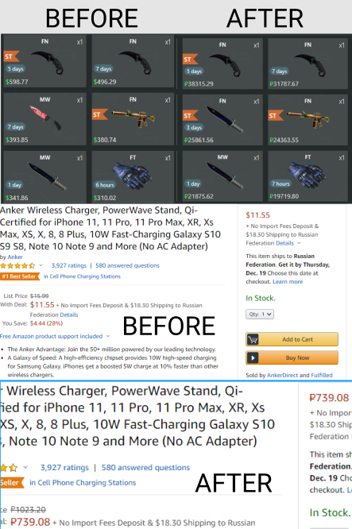

# Chrome Price Converter
`*WIP - Work In Progress still have a lot of bugs,sometimes can not work properly`

`*For reduce usage of the your RAM, extension will work only when you click on it once`

**_A Google Chrome Extension which help to convert currency._**

 

 

### **[Download][https://github.com/AydievMansur/price_parse_chrome/archive/master.zip]** `*WIP`
##### ROADMAP!

  - Friendly UI
  - Open API[?]
  - ~~MultiSite Support~~
  - ~~Chrome Integration~~;
  - Deploy to Chrome Store;
  
##### Current Supported Site
  
| Site | Link |
| ------ | ------ |
| swap.gg | [https://swap.gg/] |
| dmarket.com | [https://dmarket.com/] |
| amazon.com | [https://amazon.com/] |
| gearbest.com | [https://gearbest.com/] |

You can also:
  - Create pull request to help develop this plugin
  - All contributors will mention at this repository
  

[https://github.com/AydievMansur/price_parse_chrome/archive/master.zip]: https://github.com/AydievMansur/price_parse_chrome/archive/master.zip
